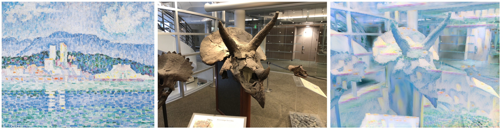
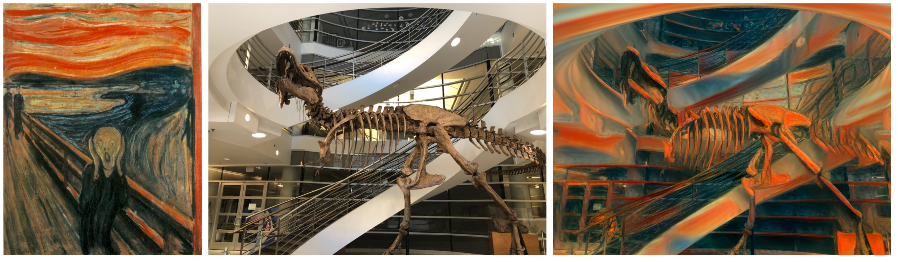
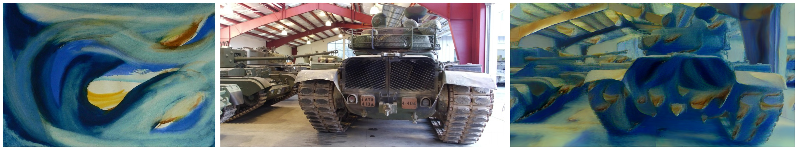
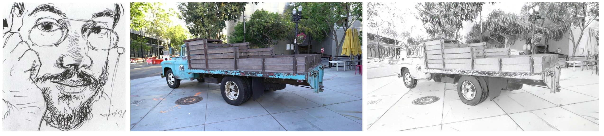
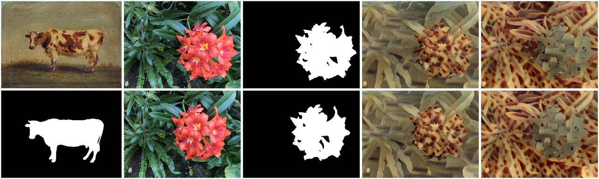
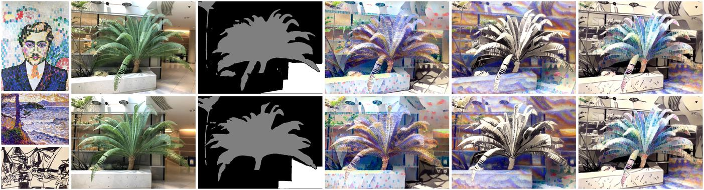

# ABC-GS: Alignment-Based Controllable Style Transfer for 3D Gaussian Splatting

[](https://arxiv.org/abs/xxxx.xxxxx)
[](https://vpx-ecnu.github.io/ABC-GS-website/)

This repository contains the official implementation of the paper **"ABC-GS: Alignment-Based Controllable Style Transfer for 3D Gaussian Splatting"**, introducing a novel approach for style transfer in 3D scenes represented by Gaussian Splatting.

## Key Features

- 🎨 **Multi Style Transfer Loss**: Supports four distinct style loss formulations (FAST, NNFM, KNN-FM, Gram Matrix)
- 🌟 **Three-Phase Training**: Pre-processing → Style Transfer → Post-processing pipeline
- 🔍 **Controllable Style Transfer**: Implements senmatic-aware and multi-style for Gaussian scene stylization
- 📦 **Modular Architecture**: Extensible design for custom loss functions and training phases

## Gallery

### Single Style Transfer




### Semantic-aware Style Transfer

### Compositional Style Transfer



## Installation

### Requirements 
- NVIDIA GPU with CUDA 11.8
- Python 3.10
- PyTorch 2.3.0

### Conda

```bash
# Clone repository with submodules
git clone https://github.com/vpx-ecnu/ABC-GS --recursive
cd ABC-GS

# Install Python dependencies
conda env create -f environment.yaml
conda activate ABC-GS
pip install abcgs/submodules/lang-segment-anything
pip install gs/submodules/diff-gaussian-rasterization
pip install gs/submodules/simple-knn
```


## Quick Start
### Dataset and Checkpoint
* For scene dataset, you can LLFF dataset in [NeRF](https://github.com/bmild/nerf) and T&T dataset in [3DGS](https://github.com/graphdeco-inria/gaussian-splatting). 
* For style dataset, you can find it in [ARF](https://github.com/Kai-46/ARF-svox2).
* **For optimal stylization results, ensure that the original scene is trained using 0th-order spherical harmonics (SH) coefficients.** Higher-order SH coefficients may introduce artifacts or inconsistencies during the style transfer process. Using 0th-order SH coefficients ensures smoother and more coherent stylization.

### Single Style Transfer
```
python style_transfer.py --config configs/llff_single.yaml
```
### Semantic-aware Style Transfer
```
python style_transfer.py --config configs/llff_semantic.yaml
```
### Compositional Style Transfer
```
python style_transfer.py --config configs/llff_multi.yaml
```

Please check `python style_transfer.py --help` or files under `configs/` for help.

## Contact

If you have any questions or suggestions, feel free to open an issue on GitHub.
You can also contact [Garv1tum](https://github.com/Grav1tum) and [lzlcs](https://github.com/lzlcs) directly.

## Citation

If you find this project useful, please give a star⭐ to this repo and cite our paper:
```bibtex
@article{liu2025abcgs,
  title={ABC-GS: Alignment-Based Controllable Style Transfer for 3D Gaussian Splatting},
  author={Wenjie Liu, Zhongliang Liu, Xiaoyan Yang, Man Sha and Yang Li},
  booktitle={IEEE International Conference on Multimedia and Expo(ICME)},
  year={2025}
}
```

## Acknowledgements

This project builds upon the following works:
- **3D Gaussian Splatting**:  
  The core 3D Gaussian rendering and optimization framework is based on the [3D Gaussian Splatting](https://github.com/graphdeco-inria/gaussian-splatting) implementation by Bernhard Kerbl et al. 
- **Lang-Segment-Anything**: \
    The semantic segmentation functionality is powered by [Lang-Segment-Anything](https://github.com/luca-medeiros/lang-segment-anything), a language-driven segmentation tool.